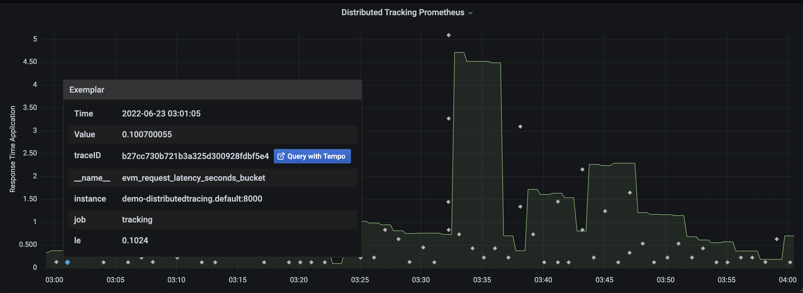
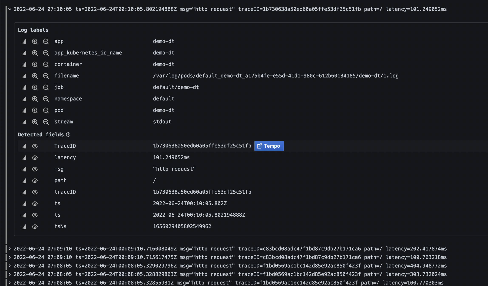

# Dummy-Distributed-Tracing
This example simple of OpenTelemetry and Prometheus in Go.  

It includes trace discovery through Logs and Exemplars.

## Steps local

1. Install Loki Docker Driver

`docker plugin install grafana/loki-docker-driver:latest --alias loki --grant-all-permissions`

2. Build the application.

`./build.sh`

3. Start everything up.

`docker-compose up -d`

4. Exercise the application.

`curl http://localhost:8000/`

5. (Optional) See OpenMetrics Exemplars.

`curl -H 'Accept: application/openmetrics-text' http://localhost:8000/metrics | less`

6. Discover Traces

### From Exemplars:

- Navigate to http://localhost:3000/explore
- Go to the explore page
- Choose the Prometheus datasource and execute `histogram_quantile(.99, sum(rate(evm_request_latency_seconds_bucket[1m])) by (le))`

### From Logs:

- Choose the Loki datasource and execute `{container_name="dummy-tracing"} | logfmt | latency > 1s`

## Step Kubernetes

`kubectl apply -f manifest.yaml`

weirt
